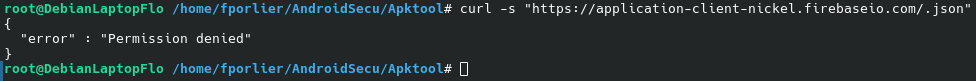
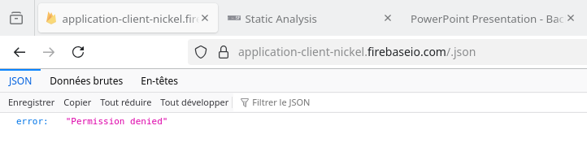

# firebase_check.md — Vérification accès public Firebase
**Application :** Nickel (`com.fpe.comptenickel`)  
**Date :** 2026-04-29 

---

## Cible

| Champ | Valeur |
|---|---|
| URL Firebase | `https://application-client-nickel.firebaseio.com` |
| Endpoint testé | `https://application-client-nickel.firebaseio.com/.json` |
| Méthode | GET (accès public non authentifié) |

---

## Commande exécutée

```bash
curl -s "https://application-client-nickel.firebaseio.com/.json"
```

---

## Réponse obtenue

```json
{"error": "Permission denied"}
```

**Code HTTP :** 401

---

**Screens Preuves :**





## Résultat

| Critère | Statut |
|---|---|
| Lecture publique sans auth | ✅ Bloquée |
| Règles de sécurité actives | ✅ Confirmé |
| Fuite de données | ✅ Aucune |

---

## Analyse

La base Firebase Realtime Database de Nickel retourne `Permission denied` sur une tentative d'accès public non authentifié. Cela indique que des **règles de sécurité Firebase sont correctement configurées** et bloquent la lecture sans authentification.

Ce test couvre uniquement l'accès public à la racine de la base. Il ne garantit pas que toutes les branches de la base sont correctement sécurisées pour les utilisateurs authentifiés.

---

## Risque résiduel

Malgré ce résultat rassurant, les identifiants Firebase restent exposés dans le binaire (voir F-02 et F-03 dans `strings_findings.md`). Un attaquant disposant d'un token Firebase valide (obtenu via un autre vecteur) pourrait potentiellement accéder à des données si les règles ne sont pas suffisamment granulaires par utilisateur.

---

## Recommandations

1. ✅ Conserver les règles de sécurité Firebase actuelles.
2. Auditer les règles Firebase pour chaque noeud de la base (pas seulement la racine).
3. Supprimer les identifiants Firebase du binaire et les charger dynamiquement depuis un backend.
